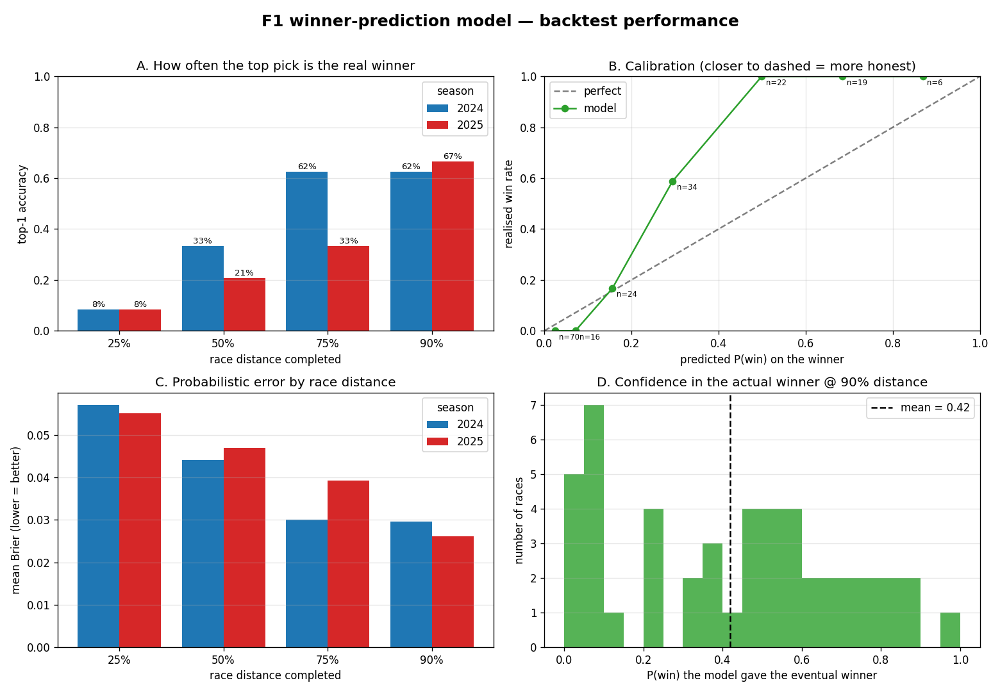

# F1 Race Winner Predictor

Predicts the Formula 1 race winner **live, during the race**, and at the flag
compares the prediction against the actual result.

It is a **hybrid ML + Monte Carlo** system, not a pure classifier. Machine learning estimates only the *parameters* of a lap (pace, safety-car / DNF
hazards, pit-stop loss); a Monte Carlo simulator combines those with the current
race state and rolls the remaining laps thousands of times to produce P(win) per
driver. Driver identity is never a feature — skill enters through a continuous
Elo rating — so the model has no "who-usually-wins" bias. See
[PROGRESS.md](PROGRESS.md) for the design rationale.

## Results

Backtested across 2019–2025 (158 races, 3000 Monte Carlo sims per checkpoint).



| Race distance | Top-1 accuracy (2024 / 2025) |
|---------------|------------------------------|
| 25% | 8% / 8% |
| 50% | 33% / 21% |
| 75% | 62% / 33% |
| **90%** | **62% / 67%** |

**How to read this:** accuracy *should* be low early — at quarter-distance the
race genuinely isn't decided, and the model correctly stays un-confident rather
than guessing. It converges to calling the winner ~2-in-3 by 90% distance. The
probabilities are **well-calibrated** (ECE ≈ 0.025): when the model is >50% sure
of a driver, that driver wins ~100% of the time.

The remaining misses are **irreducible chaos** — leader DNFs (Australia '24,
Verstappen engine fire), collisions (Austria '24), team orders (Hungary '24),
and wet-weather upsets (São Paulo '24, Verstappen from P17). The model has no
driver-identity feature, so it cannot "know" who is a wet-weather specialist; it
correctly assigns these races *low confidence* rather than being confidently
wrong. An honest, leakage-free number and a wet-skill rating are the next levers
(see [PROGRESS.md](PROGRESS.md)).

> Note: an earlier 0.88 figure was an overfit artifact (trained and scored on the
> same season). The numbers above are the honest multi-season result.

## Pipeline

```
FastF1  ──►  data/raw/         (Phase 1: bulk_history / resilient_backfill)
        ──►  data/features/    (Phase 2: elo + build_features)
        ──►  models/           (Phase 3: train — 4 LightGBM boosters)
        ──►  P(win)            (Phase 4: monte_carlo simulator)
             replay/backtest   (Phase 5)
             live runner       (Phase 6)
             Streamlit UI      (Phase 7)
```

## Quick start

```powershell
# 0. install
pip install -r requirements.txt

# 1. fetch data (rate-limit aware; FastF1 caps at ~500 API calls/hour)
python scripts/resilient_backfill.py                 # all seasons, newest first
python -m src.fetch.bulk_history --years 2024        # or a single season

# 2. build the feature table (also refreshes Elo)
python -m src.features.build_features

# 3. train the four estimators
python -m src.models.train

# 4. validate on a past race / whole season
python -m src.sim.replay --year 2024 --round 1 --step 5
python scripts/backtest.py --year 2024 --runs 3000        # omit --year for all seasons

# 4b. tune / visualise
python scripts/calibration_sweep.py --years 2024 2025     # sweep the form-offset
python scripts/plot_performance.py data/features/bt_*.parquet -o assets/performance.png

# 5. dashboard
streamlit run src/ui/app.py

# 6. live during a real GP
python -m src.live.runner record --year 2026 --round 7   # capture raw stream
python -m src.live.runner live   --year 2026 --round 7   # poll + predict
python -m src.live.runner replay --year 2024 --round 1   # offline dry-run
```

## The four estimators

| Model        | Type            | Predicts                                   |
|--------------|-----------------|--------------------------------------------|
| `pace`       | LGBM regressor  | clean green-flag lap time (s)              |
| `sc_hazard`  | LGBM classifier | P(safety-car / VSC begins this lap)        |
| `dnf_hazard` | LGBM classifier | P(a running driver retires this lap)       |
| `pit_dur`    | LGBM regressor  | pit-stop time loss (s)                     |

## Simulator notes

Each simulated future advances lap by lap: a field-wide safety car may begin
(bunching the pack, cheapening pits), the weather may change, running cars may
retire, every car runs a lap at model pace + noise, ages its tyres, and pits when
its planned stint ends. Finishing order is by total race time. Key behaviours:

- **Overtaking resistance** — a faster car only clears the car ahead with a
  per-lap probability estimated from that circuit's historical position
  volatility, so processional tracks (Monaco) behave very differently from
  high-overtaking ones (Spa, Monza). The probability also scales with the
  chaser's **tyre-age advantage**, so fresh-tyre late passes resolve correctly.
- **Dynamic weather** — each simulated future carries its own wet/dry state with
  data-estimated rain onset/drying hazards; wet running uses a separate wet pace
  table, intermediate tyres, widened lap-time variance, and a higher DNF hazard.
- **Form-of-the-day offset** — a persistent per-sim, per-driver pace delta
  (calibrated, σ≈0.15 s/lap) injects the correlated outcome variance that keeps
  P(win) honest instead of letting the favourite win every simulated future.

## Layout

```
src/
  config.py              paths, constants, FastF1 cache
  fetch/bulk_history.py  Phase 1 bulk fetcher
  features/
    raw_io.py            read the raw Parquet lake
    elo.py               multiplayer Elo ratings
    build_features.py    lap-level feature table
  models/
    spec.py              shared feature lists + categorical encoding
    train.py             train the 4 boosters
    predictors.py        load boosters, typed predict helpers
  sim/
    monte_carlo.py       vectorised simulator
    state.py             build a RaceState from features
    replay.py            lap-by-lap replay harness
  live/runner.py         live / record / replay CLI
  ui/app.py              Streamlit dashboard
scripts/
  smoke_test.py
  backtest.py            season backtest + calibration
  resilient_backfill.py  rate-limit-aware fetcher
  calibration_sweep.py   sweep the simulator form-offset for best calibration
  plot_performance.py    render the backtest performance charts (assets/)
```
